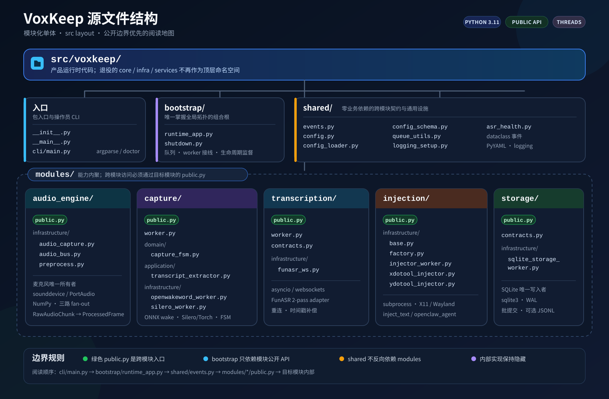
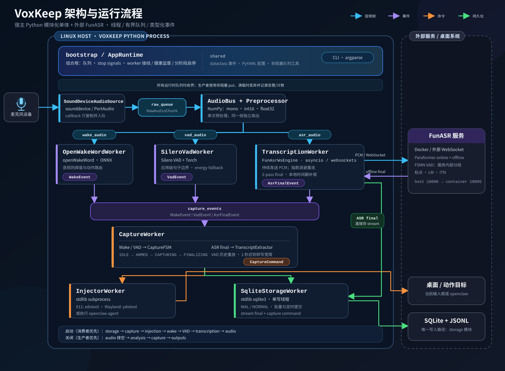

# VoxKeep 架构概览

## 约 400 字说明

VoxKeep 采用模块化单体：除 Docker 中的 FunASR 外，均运行于 Linux/Python 3.11 单进程。`bootstrap` 是组合根，创建线程和有界队列、管理启停；模块只经 `public.py` 交互，事件集中在 `shared`。`audio_engine` 以 sounddevice/NumPy 采集、预处理及三路扇出；`capture` 由 openWakeWord、Silero VAD 和 FSM 完成唤醒与句窗；`transcription` 以 asyncio/websockets 接入 FunASR 2-pass；`injection` 调用 xdotool、ydotool 或 openclaw；`storage` 用 sqlite3 单写线程、WAL 和批提交落盘。设计强调回调非阻塞、显式背压、资源单一所有权、消费者先启动及分阶段排空，架构测试锁定模块、麦克风和 SQLite 边界。配置/CLI 使用 PyYAML/argparse；开发使用 uv、pytest、Ruff、Pyright 及 CI。

## 源文件结构图

[单独查看源文件结构图](images/source-structure.svg)

## 架构与运行流程图

[单独查看架构与运行流程图](images/runtime-architecture.svg)

> 读图提示：宿主进程中的 Silero VAD 产生 `VadEvent`，用于 VoxKeep 的捕获窗口；FunASR 容器内的 FSMN VAD 仅负责 ASR 服务自身的端点检测与分段。ASR 音频从运行时启动后持续传输，不受唤醒或宿主 VAD 开关控制。
